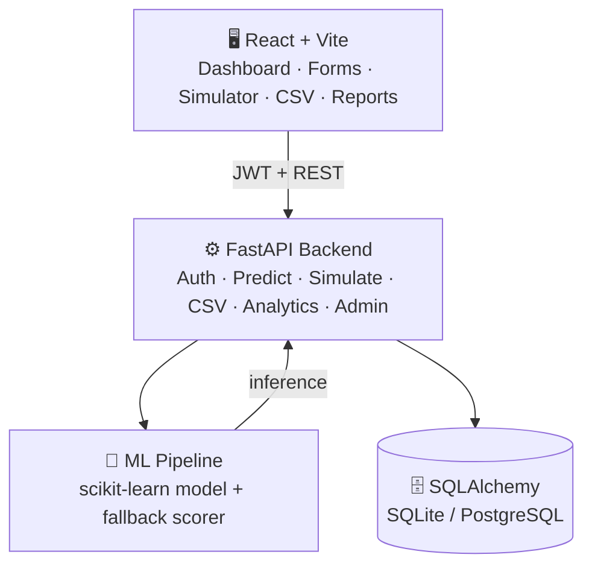
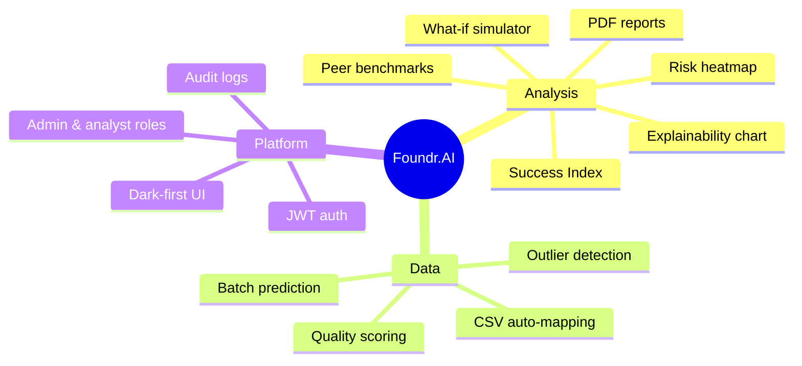
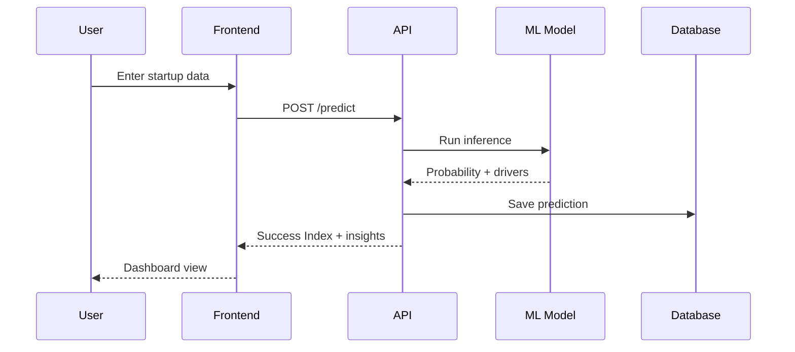
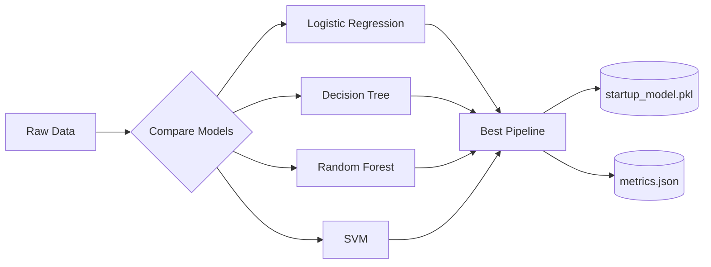

<div align="center">

# 🚀 Foundr.AI
### Startup Decision-Intelligence Workspace

A decision-intelligence workspace that turns startup operating data into a success probability, explainable insights, risk signals, and investor-ready reports.

`React` · `Vite` · `FastAPI` · `SQLAlchemy` · `scikit-learn` · `JWT Auth` · `MIT License`

**Model probability → Success Index → Explainability → Risk Signals → Investor Reports**

</div>

---

## 🏗️ Architecture



---

## ✨ Feature Map



---

## 🔄 Core Flow



---

## ⚡ Quick Start

<table>
<tr>
<td width="50%" valign="top">

**1️⃣ Backend**
```powershell
python -m venv backend/.venv
.\backend\.venv\Scripts\python.exe -m pip install -r backend/requirements.txt
.\backend\.venv\Scripts\python.exe -m uvicorn backend.main:app --reload --port 8000
```
🔑 Demo login: `demo` / `demo1234`

</td>
<td width="50%" valign="top">

**2️⃣ Frontend**
```powershell
cd frontend
npm install
npm run dev
```
🌐 Open `http://localhost:5173`

</td>
</tr>
</table>

### 🔧 Environment Variables

| Variable | Purpose |
|---|---|
| `DATABASE_URL` | SQLite (dev) / PostgreSQL (prod) |
| `JWT_SECRET` | Random signing secret |
| `CORS_ORIGINS` | Allowed frontend origins |
| `VITE_API_URL` | Frontend → API base URL |

---

## 🧠 Model Training

```powershell
python -m ml_pipeline.train
```



---

## 📥 CSV Import

| Limit | Value |
|---|---|
| Max rows | 200 |
| Max size | 2 MB |
| Auto-mapped fields | `company`, `sector`, `employees`, `arr`, `monthly_burn`, `tam`, `yoy_growth` |

---

## 📡 API Reference

> Full interactive docs → `http://localhost:8000/docs`

| Category | Endpoints |
|---|---|
| 🔐 Auth | `POST /login` · `POST /register` · `GET /me` · `PATCH /me` · `POST /me/password` |
| 📊 Predict | `POST /predict` · `POST /simulate` |
| 📁 Batch | `POST /csv/validate` · `POST /csv/predict` |
| 📈 Insights | `GET /dashboard` · `GET /history` · `GET /analytics` · `GET /logs` · `GET /download-csv` |
| 🛡️ Admin | `GET /users` · `PATCH /users/{user_id}` |

---

## ✅ Testing

```powershell
.\backend\.venv\Scripts\python.exe -m unittest discover -s backend\tests -v
cd frontend && npm run build && npm run test:e2e
```

---

## 🚢 Deployment Checklist

- [ ] `DATABASE_URL` → PostgreSQL
- [ ] `JWT_SECRET` → long random value
- [ ] `CORS_ORIGINS` → exact frontend origin(s)
- [ ] `alembic upgrade head`
- [ ] Serve over HTTPS

---

## 👥 Administration

Admins manage roles from the **Team** page. Self-demotion/suspension is blocked. Suspended users keep history but lose access.

---

## 📄 License

<details>
<summary><b>MIT License</b> — click to expand</summary>

```
MIT License

Copyright (c) 2026 Foundr.AI

Permission is hereby granted, free of charge, to any person obtaining a copy
of this software and associated documentation files (the "Software"), to deal
in the Software without restriction, including without limitation the rights
to use, copy, modify, merge, publish, distribute, sublicense, and/or sell
copies of the Software, and to permit persons to whom the Software is
furnished to do so, subject to the following conditions:

The above copyright notice and this permission notice shall be included in all
copies or substantial portions of the Software.

THE SOFTWARE IS PROVIDED "AS IS", WITHOUT WARRANTY OF ANY KIND, EXPRESS OR
IMPLIED, INCLUDING BUT NOT LIMITED TO THE WARRANTIES OF MERCHANTABILITY,
FITNESS FOR A PARTICULAR PURPOSE AND NONINFRINGEMENT. IN NO EVENT SHALL THE
AUTHORS OR COPYRIGHT HOLDERS BE LIABLE FOR ANY CLAIM, DAMAGES OR OTHER
LIABILITY, WHETHER IN AN ACTION OF CONTRACT, TORT OR OTHERWISE, ARISING FROM,
OUT OF OR IN CONNECTION WITH THE SOFTWARE OR THE USE OR OTHER DEALINGS IN THE
SOFTWARE.
```

</details>

---

<div align="center">

**🤝 Contributions welcome** — fork, branch, test, PR.

</div>
