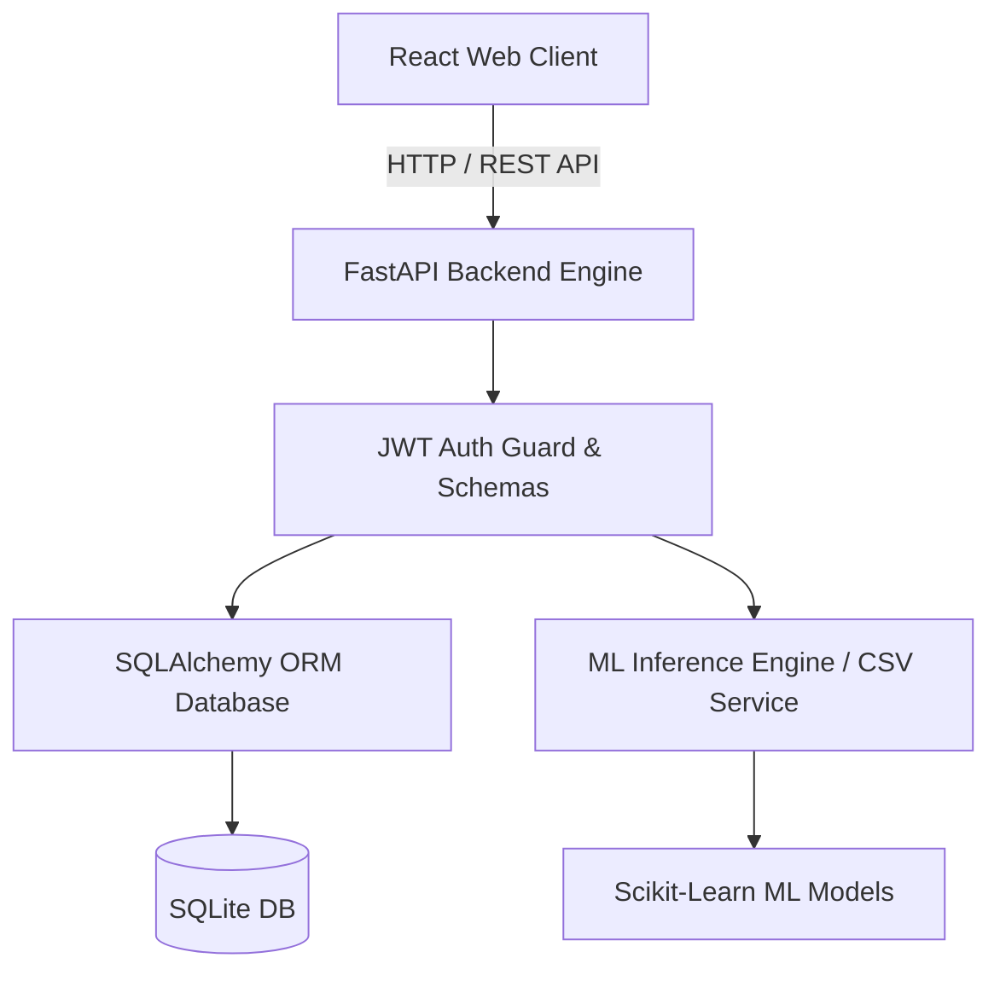

<div align="center">

# 🚀 Foundr.AI — AI Startup Success Predictor & BI Dashboard

### *Turn Startup Operating Data into Actionable Intelligence & Success Probabilities*


</div>

---

## 📌 Overview

**Foundr.AI** is an enterprise-grade AI decision-intelligence application designed to predict startup success probabilities and model failure risks using machine learning. By evaluating crucial operational metrics—funding rounds, cash burn rate, team size, market size, revenue metrics, and traction growth—Foundr.AI provides founders, investors, and accelerators with transparent, explainable financial risk scores and predictive recommendations.

---

## ✨ Key Features

- 🎯 **Predictive ML Classification Engine**: Custom machine learning classifiers (Random Forest, Gradient Boosting) trained to output granular success vs failure probabilities.
- 📊 **Interactive Analytics Dashboard**: Dynamic data visualizations showcasing financial health, risk radar, and growth velocity metrics.
- 📁 **Batch CSV Scoring**: Upload batch startup datasets (`.csv`) for instant multi-company evaluation and risk categorization.
- 🔐 **Secure JWT Authentication & RBAC**: Role-Based Access Control protecting sensitive founder data and administrative configurations.
- ⚡ **High-Performance FastAPI Backend**: Asynchronous RESTful API layer powered by Pydantic validation, SQLAlchemy ORM, and Alembic database migrations.
- 💻 **Modern React UI**: Sleek, responsive user interface built with modern component architectures and micro-animations.

---

## 🏗️ System Architecture


```mermaid
graph TD
    A[React Web Client] -->|HTTP / REST API| B[FastAPI Backend Engine]
    B --> C[JWT Auth Guard & Schemas]
    C --> D[SQLAlchemy ORM Database]
    C --> E[ML Inference Engine / CSV Service]
    E --> F[Scikit-Learn ML Models]
    D --> G[(SQLite DB)]
```

---

## 📁 Repository Structure

```
Ai_Startup_Success_Predictor/
├── backend/
│   ├── main.py                # FastAPI Application Entrypoint
│   ├── database.py            # SQLite Connection Setup
│   ├── models.py              # SQLAlchemy DB Models
│   ├── schemas.py             # Pydantic Schemas & Validation
│   ├── services.py            # ML Scoring & Business Logic
│   ├── csv_service.py         # Batch CSV Processing Engine
│   ├── seed.py                # Database Seeder Script
│   ├── requirements.txt       # Python Dependencies
│   └── migrations/            # Alembic DB Migrations
├── Failure_Model.ipynb        # Model Training & EDA Notebook
├── ML_Classifier.ipynb        # Model Evaluation & Tuning
└── README.md                  # Project Documentation
```

---

## 🚀 Quick Start & Installation

### Prerequisites
- **Python 3.10+**
- **Node.js 18+** & **npm**

### 1. Backend Setup
```bash
# Navigate to backend directory
cd backend

# Create virtual environment
python -m venv .venv
source .venv/bin/activate  # On Windows: .venv\Scripts\activate

# Install dependencies
pip install -r requirements.txt

# Run database seeder (Optional)
python seed.py

# Start FastAPI server
uvicorn main.py --reload --port 8000
```
*Backend API will be live at `http://localhost:8000` (Swagger docs at `http://localhost:8000/docs`).*

### 2. Frontend Setup (If applicable)
```bash
npm install
npm run dev
```

---

## 🔗 API Endpoint Reference

| Method | Endpoint | Description |
|---|---|---|
| `POST` | `/api/auth/register` | Register a new founder / investor account |
| `POST` | `/api/auth/login` | Authenticate & retrieve JWT bearer token |
| `POST` | `/api/predict` | Run single startup success prediction |
| `POST` | `/api/predict/csv` | Upload batch CSV file for automated scoring |
| `GET` | `/api/dashboard/stats` | Retrieve aggregated dashboard analytics |

---

## 📄 License

This project is licensed under the **MIT License** — see the `LICENSE` file for details.
