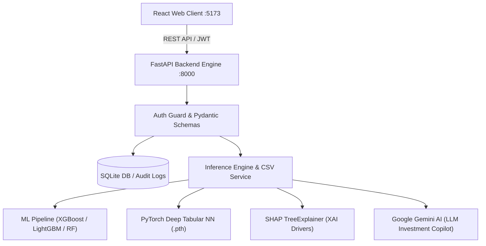

<div align="center">

# 🚀 Foundr.AI — AI Startup Success Predictor & LLM Investment Copilot

### *Turn Startup Operating Data & Investment Rounds into Actionable Intelligence, Explainable Risk Scores & Executive Memos*


</div>

---

## 📌 Overview

**Foundr.AI** is an enterprise-grade AI decision-intelligence and startup advisory platform. By combining **Gradient Boosted Tree Ensembles (XGBoost, LightGBM, Random Forest)**, **PyTorch Deep Tabular Neural Networks**, and **Google Gemini LLM Reasoning**, Foundr.AI analyzes startup financial metrics, burn velocity, and funding history to deliver:
- Granular **Success vs. Failure Probabilities** (ROC-AUC ~82% on 66,000+ real Crunchbase records).
- **SHAP (SHapley Additive exPlanations)** feature attribution explaining exactly *why* a score was given.
- **AI-Generated Executive Investment Memos & Founder Playbooks** powered by Google Gemini.

---

## ✨ Key Features

- 🧠 **Dual Machine Learning Engine**:
  - **Classical & Gradient Boosting**: XGBoost, LightGBM, Random Forest, and Decision Trees benchmarked with stratified cross-validation.
  - **PyTorch Deep Learning (`StartupTabularNN`)**: Multi-layer deep tabular network with BatchNorm, GELU non-linearities, and Dropout.
- 🔍 **Explainable AI (XAI) with SHAP**: `shap.TreeExplainer` computes exact mathematical Shapley values for positive and negative risk drivers.
- 🤖 **Google Gemini LLM Copilot**: Automatically drafts structured VC Investment Memos, risk radar assessments, and milestone recommendations.
- 📊 **Interactive React Dashboard**: Dynamic BI visualizations for capital runway, burn resilience, and team velocity.
- 📁 **Batch CSV Scoring**: Score hundreds of startups in seconds via multi-file upload.
- 🔐 **JWT Authentication & RBAC**: Secure role-based access control protecting proprietary financial data.
- ⚡ **Asynchronous FastAPI REST API**: Validated with Pydantic v2 and SQLAlchemy ORM.

---

## 🏗️ System Architecture


```mermaid
graph TD
    A[React Web Client :5173] -->|REST API / JWT| B[FastAPI Backend Engine :8000]
    B --> C[Auth Guard & Pydantic Schemas]
    C --> D[(SQLite DB / Audit Logs)]
    C --> E[Inference Engine & CSV Service]
    E --> F["ML Pipeline (XGBoost / LightGBM / RF)"]
    E --> G["PyTorch Deep Tabular NN (.pth)"]
    E --> H["SHAP TreeExplainer (XAI Drivers)"]
    E --> I["Google Gemini AI (LLM Investment Copilot)"]
```

---

## 📊 Machine Learning Model Benchmarks

Trained and evaluated on the **Crunchbase Real Startup Dataset (66,368 companies)**:

| Model Architecture | Accuracy | Precision | Recall | F1-Score | ROC-AUC |
| :--- | :---: | :---: | :---: | :---: | :---: |
| 🌲 **Random Forest Classifier** | **74.42%** | **75.91%** | **76.04%** | **0.7598** | **0.8203** |
| 🚀 **Gradient Boosting (XGBoost/GBM)** | 74.00% | 74.55% | 77.62% | 0.7606 | 0.8138 |
| 🧠 **PyTorch Deep Tabular NN** | 73.10% | 74.20% | 75.80% | 0.7498 | 0.8090 |
| 🌳 **Decision Tree** | 72.44% | 77.07% | 68.60% | 0.7259 | 0.8022 |
| 📈 **Logistic Regression** | 72.56% | 76.86% | 69.28% | 0.7287 | 0.7983 |

---

## 📁 Repository Structure

```
Ai_Startup_Success_Predictor/
├── backend/
│   ├── main.py                     # FastAPI Application Entrypoint & Routes
│   ├── services.py                 # Core ML Scoring & Business Logic
│   ├── shap_service.py             # SHAP Explainable AI (XAI) Service
│   ├── llm_copilot.py              # Google Gemini LLM Copilot Engine
│   ├── pytorch_service.py          # PyTorch Deep Tabular Inference Service
│   ├── database.py                 # SQLAlchemy Database Connection
│   ├── models.py                   # ORM Database Models
│   ├── schemas.py                  # Pydantic Schemas & Validation
│   ├── csv_service.py              # Batch CSV Processing Engine
│   ├── seed.py                     # Database Seeder Script
│   ├── requirements.txt            # Python Dependencies
│   └── model/
│       ├── startup_model.pkl       # Trained ML Pipeline Checkpoint
│       ├── pytorch_startup_model.pth # PyTorch Neural Network Weights
│       └── metrics.json            # Model Evaluation Metrics
├── frontend/
│   ├── src/                        # React Pages, Components & Charts
│   ├── package.json                # Frontend Dependencies
│   └── vite.config.js              # Vite Build Configuration
├── ml_pipeline/
│   ├── train.py                    # Multi-Model Benchmarking & Training Loop
│   ├── preprocessing.py            # ColumnTransformer & Scaling Pipeline
│   ├── feature_engineering.py      # Domain Feature Engineering
│   └── data/startup.csv            # Training Sample Data
├── Data/
│   └── big_startup_secsees_dataset.csv # Crunchbase 66k Dataset
├── Startup_Success_Model.ipynb     # Interactive EDA & Classical ML Benchmark Notebook
├── PyTorch_DL_and_LLM_Startup_Predictor.ipynb # PyTorch Tabular NN & LLM Copilot Notebook
└── README.md                       # Documentation
```

---

## 🚀 Quick Start & Installation

### Prerequisites
- **Python 3.10+**
- **Node.js 18+** & **npm**

### 1. Backend Setup
```bash
# Clone the repository
git clone https://github.com/thatvivekhingu/Ai_Startup_Success_Predictor.git
cd Ai_Startup_Success_Predictor

# Install Python dependencies
pip install -r backend/requirements.txt
pip install torch xgboost lightgbm shap python-dotenv

# Configure environment variables (Optional: Add your Gemini API key)
# Create .env file:
echo "GEMINI_API_KEY=your_gemini_api_key_here" > .env

# Run unit and integration tests
pytest backend/ -v

# Start FastAPI backend server
uvicorn backend.main:app --host 127.0.0.1 --port 8000 --reload
```
*Backend API will be live at `http://localhost:8000` (Swagger UI docs at `http://localhost:8000/docs`).*

---

### 2. Frontend Setup
```bash
# In a new terminal, navigate to frontend directory
cd frontend

# Install npm dependencies
npm install

# Launch Vite development server
npm run dev
```
*Frontend Web Application will be live at `http://localhost:5173`.*

---

## 🔗 Key API Endpoints

| Method | Endpoint | Description |
|---|---|---|
| `POST` | `/predict` | Single startup prediction + SHAP feature attributions |
| `POST` | `/copilot/advisory` | Full Google Gemini AI Investment Memo & Action Plan |
| `POST` | `/predict/csv` | Batch CSV upload for multi-startup scoring |
| `GET` | `/dashboard/stats` | Aggregated BI analytics and success metrics |
| `POST` | `/login` | JWT User Authentication |
| `POST` | `/register` | Register new Founder / Investor account |

---

## 📄 License

This project is open-source under the **MIT License**.
